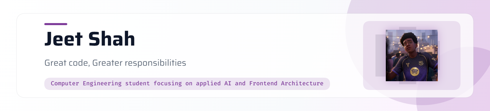

<picture>
   <source media="(prefers-color-scheme: dark)" srcset="art/header-dark.png">
   
</picture>

About Me : 
<table> <tr> <td width="65%" valign="middle">

Computer Engineering student building AI-powered systems — from security training platforms to sports analytics. Outside of code: F1 weekends, football, the occasional chess game, and sketching when the queue is right.

</td> <td width="35%" align="center">  </td> </tr> </table>  

### Tech Stack:

                 
  

# 📊 GitHub Stats:

   
 
  
 
  
  

### Contribution Snake

 <picture> <source media="(prefers-color-scheme: dark)" srcset="https://raw.githubusercontent.com/JeetShah-10/JeetShah-10/output/github-contribution-grid-snake-dark.svg" /> <source media="(prefers-color-scheme: light)" srcset="https://raw.githubusercontent.com/JeetShah-10/JeetShah-10/output/github-contribution-grid-snake.svg" />  </picture> 
  

  
  

### 🔗 Connect

    
   
  

